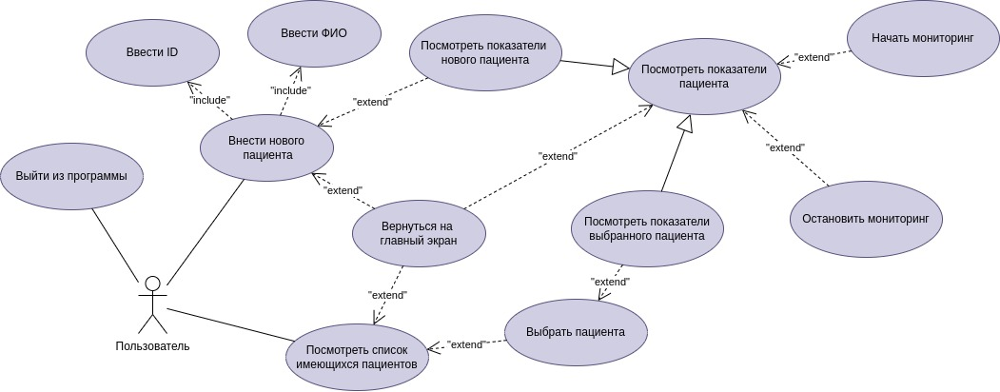
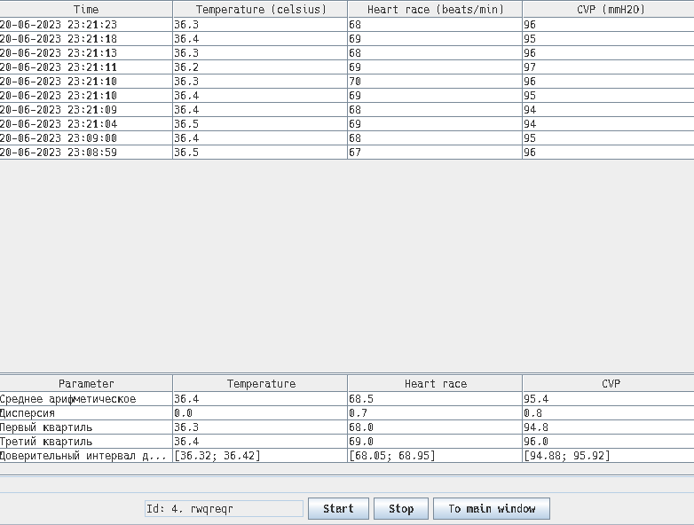

### Задание

Создание синтетической системы мониторинга состояния здоровья пациента. Система
ведет учет пациентов, генерирует и отслеживает показатели температуры, сердечного
ритма и центрального венозного давления каждого пациента.

#### **Требования к пользовательскому интерфейсу:** 

##### *Пользовательский интерфейс должен реализовывать:*
1. В главном меню должно быть реализованы кнопки «Новый пациент», «Открыть
пациента», «Выход».
2. При выборе «Нового пациента» должна быть реализована возможность поля для
ввода номера пациента (ID) и его ФИО с кнопкой «Создать».
3. выборе «Открыть пациента» должен быть список доступных пациентов.
4. При выборе или создании пациента, должно меняться окно на окно мониторинга,
на экране которого должны отображаться такие данные:
   1. ID пациента
   2. ФИО
   3. последних 10 измерений температуры;
   4. последних 10 измерений сердечного ритма;
   5. последних 10 измерений центрального венозного давления.
5.  На экране «окно мониторинга» пациента должны присутствовать кнопки «начать
мониторинг» и «завершить мониторинг».
6. При выходе из нормального состояния одного из показателей должно выскочить
окно об проблеме, а также данный показатель на главном окне покрашен в
красный цвет до его исправления на нормальное состояние.


#### **Функциональные требования:**

+  Система должна генерировать данные в многопоточном режиме параллельно с
работой пользовательского интерфейса.
+  Генерация данных должна начинаться при нажатии кнопки «начать мониторинг» и
завершится при нажатии кнопки «завершить мониторинг».
+  Данные должны генерироваться каждые 5 секунд случайным образом и
соответствовать реально существующим медицинским показателям.
+  Должно быть реализован случайный уход данных в критический режим и
восстановление из него.
+  Данные не должны генерироваться так, чтобы был резкий скачок показателей.
+  Система должна хранить лог-файл на каждого пациента.
+  Название лог-файла должно совпадать с номером пациента.
+  Система должна считывать количество и названия лог-файлов для отображения
списка пациентов.
+  При загрузке существующего пациента, из лог-файла должны подгружаться 10
предыдущих значений.
+  При отсутствии 10 наблюдений, отсутствующие наблюдения в интерфейсе должны
отображаться как «-».


#### **Дополнительный функционал:**

1. Добавить новый функционал – время исследования:
   +  при считывании показаний должно быть записаны время их съема;
   +  если показания перешли в нестандартный режим, должно быть отображено
время начало фиксирования таких данных;
   +  при восстановлении нормального режима, должно быть отображено время,
затраченного на восстановление пациента.
2. Реализовать статистические характеристики медицинских показателей пациента.
    + расчет среднего для каждого из показателей;
    + расчет математического ожидания для каждого из показателей;
    + расчет дисперсии для каждого из показателей.
    + расчет первого и четвертого квартиля.

<div style="page-break-after: always;"></div>

### [ER-диаграмма основных сущностей предметной области](https://github.com/Snow0w/Mephi_java_exam_project/blob/master/files/ER.jpg)


###  [Use-case диаграмма](https://github.com/Snow0w/Mephi_java_exam_project/blob/master/files/UseCaseExam.jpg)

<div style="page-break-after: always;"></div>

###  [UML диаграмма классов](https://github.com/Snow0w/Mephi_java_exam_project/blob/master/files/umlClass.jpg)


<div style="page-break-after: always;"></div>

### Wireframe эскизы GUI

#### 1. [Intro Wireframe](https://github.com/Snow0w/Mephi_java_exam_project/blob/master/files/IntroWire.png)


#### 2. [New Patient Wireframe](https://github.com/Snow0w/Mephi_java_exam_project/blob/master/files/NewWire.png) 


#### 3. [Select Patient Wireframe](https://github.com/Snow0w/Mephi_java_exam_project/blob/master/files/SelectWire.png)


#### 4. [Monitor Wireframe](https://github.com/Snow0w/Mephi_java_exam_project/blob/master/files/MonitorWire.png)


<div style="page-break-after: always;"></div>

### Скриншоты реализованного интерфейса
#### 1. [Intro Frame](https://github.com/Snow0w/Mephi_java_exam_project/blob/master/files/IntroFrame.png)


#### 2. [New Patient Frame](https://github.com/Snow0w/Mephi_java_exam_project/blob/master/files/NewPatientFrame.png)


#### 3. [Select Patient Frame](https://github.com/Snow0w/Mephi_java_exam_project/blob/master/files/SelectPatientFrame.png)


#### 4. [Monitor Frame](https://github.com/Snow0w/Mephi_java_exam_project/blob/master/files/MonitorFrame.png)



<div style="page-break-after: always;"></div>

### Описание функционирования программы

Программа предоставляет пользователю простой интерфейс для наблюдения за показателями данных о здоровье пациента. В рамках данной реализации данные генерируются случайным образом. При запуске, программа считывает логфайлы (`.medlog`) в текущей директории для формирования списка имеющихся пациентов. Также открывается главный экран
#### Главный экран
На главном экране есть три кнопки: 
1. добавить пациента
2. выбрать пациента
3. выйти

При нажатии на них происходит следующее:
##### 1. добавить пациента
При нажатии на первую окно меняется на окно добавления пациента с полями для ввода информации о новом пациенте (Id и ФИО), а также кнопками:
1. добавить пациента``
2. назад.

При нажатии на вторую, пользователь вернется на главное окно. При нажатии на первую, в программе создастся запись о новом пациенте, а также создастся логфайл с расширением `.medlog` и `id` пациента в качестве названия. После этого пользователя сразу перенесет на окно мониторинга за состоянием пациента.
##### 2. выбрать пациента
При нажатии на вторую пользователя перенесет на 
экран выбора пациента. В выдвигающемся списке (элемент `JComboBox`), будут представлены хранящиеся в системе пациенты. На этом экране также есть две кнопки:
1. показать пациента
2. назад

При нажатии на вторую, пользователь вернется на главное окно. При нажатии на первую, пользователя перенесет на экран мониторинга за выбранным в выдвигающемся списке пациенте. 
##### 3. выйти
Программа завершается
#### Экран мониторинга
Сверху расположена таблица (`JTable`), показывающая последние 10 показаний медицинских параметров пациента. Ниже таблица (`JTable`), показывающая статистические данные наблюдаемых параметров. Еще ниже расположено текстовое поле (`JTextField`), в котором будет выводиться информация о продолжительности *опасного состояния* пациента.
> *Опасное состояние* - состояние пациента, когда какой-либо показатель выходит за пределы установленной нормы. 

В самом низу расположены управляющие кнопки окна мониторинга:
1. Запустить мониторинг
2. Остановить мониторинг
3. Вернуться на главный экран

При запуске мониторинга каждые 5 секунд будет генерироваться новое измерение показателей пациента. Информация в таблицах будет соответствующим образом изменяться. При переходе человека в *опасное состояние* всплывает соответствующее окно с предупреждением. Также вышедший за пределы нормы показатель окрашивается в красный цвет. После выхода пациента из *опасного состояния* обновляется надпись о продолжительности пребывания пациента в *опасном состоянии*. При остановке мониторинга, генерации данных заканчивается. При выходе на главный экран, пользователя перекидывает на главный экран. В рамках данной реализации программы, нельзя вернуться на главный экран при активном состоянии мониторинга. 

<div style="page-break-after: always;"></div>

### Приложение А. [Логи системы контроля версий](https://github.com/Snow0w/Mephi_java_exam_project/commits/master)*
\*На момент написания отчета
```
commit f2e7f94f24b43421248d71a7a6fa7f6262b70157
Author: omanie <kkiirriikm@gmail.com>
Date: Wed Jun 21 18:21:19 2023 +0300

Cosmetic changes 2

commit ba490d2b69120a882607b8ddd7b366daca667b52
Author: omanie <kkiirriikm@gmail.com>
Date: Wed Jun 21 11:45:19 2023 +0300

Cosmetic changes 1

commit b28b06c23d050e2c0c38f7e3ccfd6e13cd57b557
Author: omanie <kkiirriikm@gmail.com>
Date: Tue Jun 20 23:20:38 2023 +0300

Change seconds stop to 5

commit b09c42e6fc43c7029ffc29727b0f723d75439fcd
Author: omanie <kkiirriikm@gmail.com>
Date: Tue Jun 20 23:17:08 2023 +0300

Code complete

commit 7f48cd3421c75a30d47a4b5a01bfc64e2caabb2b
Author: omanie <kkiirriikm@gmail.com>
Date: Tue Jun 20 21:16:03 2023 +0300

add comps to monitor panel and realize duration task

commit 7c3d6da94684e3faaff410d4de11a75f1b13be25
Author: omanie <kkiirriikm@gmail.com>
Date: Tue Jun 20 19:14:14 2023 +0300

Finish first part

commit 5bab2449cd789060bdda0e0c7533af59248eb506
Author: omanie <kkiirriikm@gmail.com>
Date: Tue Jun 20 17:37:14 2023 +0300

fix mistakes

commit 16363ac3c919f1f0175aaab7243a7883027a08cb
Author: omanie <kkiirriikm@gmail.com>
Date: Tue Jun 20 16:40:54 2023 +0300

added thread work and table colour

commit 93aa9f5e28b69f05331060ce2496b5d488a678e5
Author: omanie <kkiirriikm@gmail.com>
Date: Tue Jun 20 01:02:11 2023 +0300

Start code monitor pane, add first version table model. TODO:
parse human log file for history measurement info
implement thread generator and write to log file
errors handling
that's all

commit 6609f43bebbf90656b6205a1fdc1a627210ead02
Author: omanie <kkiirriikm@gmail.com>
Date: Mon Jun 19 22:46:15 2023 +0300

Add write log for new patient and read logs at startup

commit 5cf0c799eb5926fb21b1984273a556fbdbc43e61
Author: omanie <kkiirriikm@gmail.com>
Date: Mon Jun 19 21:21:51 2023 +0300

Measurement generator

commit 612fed65767c58b774df9055a5c0062c7194e03a
Author: omanie <kkiirriikm@gmail.com>
Date: Mon Jun 19 17:35:42 2023 +0300

Human add logic without log file

commit b595706f62a2d770743823c795a0cbaabb160baa
Author: omanie <kkiirriikm@gmail.com>
Date: Mon Jun 19 14:27:54 2023 +0300

start working. Add three jpanels
```


### Приложение Б. [Исходный код программы](https://github.com/Snow0w/Mephi_java_exam_project)
#### Exam.java
```java
package edu.mephi;

import edu.mephi.gui.Gui;

public class Exam {
  public static void main(String[] args) {
    Gui gui = new Gui("Patient simulation");
    gui.setVisible(true);
  }
}
```

#### StatThread.java
```java
package edu.mephi.thread;

import edu.mephi.gui.renderModels.StatisticsTableModel;
import edu.mephi.measurement.Measurement;
import edu.mephi.stats.DataToTableTransformer;
import java.util.ArrayList;

public class StatThread implements Runnable {
  private DataToTableTransformer trans;
  private ArrayList<Measurement> data;

  public StatThread(StatisticsTableModel model, ArrayList<Measurement> data) {
    trans = new DataToTableTransformer(model);
    this.data = data;
  }

  @Override
  public void run() {
    try {
      while (!Thread.currentThread().isInterrupted()) {
        synchronized (data) {
          data.wait();
          trans.updateTable(data);
        }
      }
    } catch (InterruptedException e) {
    }
  }
}
```


#### MonitorThread.java
```java
package edu.mephi.thread;

import edu.mephi.gui.renderModels.MonitorTableModel;
import edu.mephi.human.Human;
import edu.mephi.log.WriteLog;
import edu.mephi.measurement.Measurement;
import edu.mephi.measurement.MeasurementFabric;
import edu.mephi.measurement.MeasurementStatus;
import java.io.IOException;
import java.time.Duration;
import java.time.LocalDateTime;
import java.time.format.DateTimeFormatter;
import java.util.ArrayList;
import java.util.concurrent.TimeUnit;
import javax.swing.JOptionPane;
import javax.swing.JTextField;

public class MontitorThread implements Runnable {
  private static final int SECONDSSLEPP = 5;
  private Human human;
  private ArrayList<Measurement> data;
  private MonitorTableModel tableModel;
  private boolean isSick;
  private Thread inform;
  private LocalDateTime startSickTime;
  private JTextField durationLabel;

  public MontitorThread(Human human, ArrayList<Measurement> data,
                        MonitorTableModel tableModel,
                        JTextField durationLabel) {
    this.human = human;
    this.data = data;
    this.tableModel = tableModel;
    this.isSick = false;
    this.inform = null;
    this.startSickTime = null;
    this.durationLabel = durationLabel;
  }

  @Override
  public void run() {
    WriteLog writer = null;
    try {
      writer = new WriteLog(human);
      monitoring(writer);
    } catch (IOException e) {
      JOptionPane.showMessageDialog(null, "Can't write to log file",
                                    "Can'r write", JOptionPane.ERROR_MESSAGE);
    } catch (InterruptedException e) {
    } finally {
      if (writer == null)
        return;
      try {
        writer.closeLogFile();
      } catch (IOException e) {
        // e.printStackTrace();
      }
    }
  }

  private void monitoring(WriteLog writer)
      throws IOException, InterruptedException {
    MeasurementFabric fabric = new MeasurementFabric();
    Measurement measurement = null;
    Measurement prev = null;
    try {
      synchronized (data) { prev = data.get(data.size() - 1); }
    } catch (IndexOutOfBoundsException e) {
      prev = null;
    }
    while (true) {
      measurement = fabric.createMeasurement(prev);
      prev = measurement;
      checkHumanStatus(measurement);
      synchronized (data) {
        data.add(measurement);
        data.notify();
      }
      writer.writeMeasurementInLogFile(measurement);
      synchronized (tableModel) { tableModel.updateTable(measurement); }
      TimeUnit.SECONDS.sleep(SECONDSSLEPP);
    }
  }

  private void checkHumanStatus(Measurement measurement) {
    MeasurementStatus status = measurement.getMeasurementStatus();
    if (!status.isOk() && !isSick) {
      if (inform == null || inform.getState() == Thread.State.TERMINATED) {
        InformThread task = new InformThread(measurement.getStringTime());
        inform = new Thread(task);
        inform.start();
      }
      startSickTime = measurement.getTime();
      isSick = true;
    }
    if (status.isOk() && isSick) {
      updateLabel(LocalDateTime.now());
      isSick = false;
    }
  }

  private void updateLabel(LocalDateTime now) {
    String start = startSickTime.format(
        DateTimeFormatter.ofPattern("dd-MM-yyyy HH:mm:ss"));
    Duration dur = Duration.between(startSickTime, now);
    durationLabel.setText("Start illness: " + start +
                          ", duration: " + dur.getSeconds() + " seconds");
  }
}
```


#### InformThread.java
```java
package edu.mephi.thread;

import javax.swing.JOptionPane;

public class InformThread implements Runnable {
  private String time;

  public InformThread(String time) { this.time = time; }

  @Override
  public void run() {
    try {
      JOptionPane.showMessageDialog(null, "Problem in " + time);
    } catch (Exception e) {
    }
  }
}
```


#### Result.java
```java
package edu.mephi.stats;

public class Result {
  public String name;
  public Object value;
  public Result() {}
  public Result(String name, Object value) {
    this.name = name;
    this.value = value;
  }
}
```


#### DataToTableTransformer.java
```java
package edu.mephi.stats;

public class Result {
  public String name;
  public Object value;
  public Result() {}
  public Result(String name, Object value) {
    this.name = name;
    this.value = value;
  }
}
```


#### Calculate.java
```java
package edu.mephi.stats;

public class Result {
  public String name;
  public Object value;
  public Result() {}
  public Result(String name, Object value) {
    this.name = name;
    this.value = value;
  }
}
```


#### MeasurementStatus.java
```java
package edu.mephi.measurement;

public class MeasurementStatus {
  public static final int DANGER_LOW_ZONE = 0;
  public static final int LOW_ZONE = 1;
  public static final int NORMAL_ZONE = 2;
  public static final int HIGH_ZONE = 3;
  public static final int DANGER_HIGH_ZONE = 4;
  public final static int TEMPERATURE = 0;
  public final static int HEARTRATE = 1;
  public final static int VENOUSPRESSURE = 2;
  public final static int INVALIDPARAMETER = -1;
  private int temperatureStatus;
  private int heartRateStatus;
  private int venousPressureStatus;

  public MeasurementStatus(int temperatureStatus, int heartRateStatus,
                           int venousPressureStatus) {
    this.venousPressureStatus = venousPressureStatus;
    this.heartRateStatus = heartRateStatus;
    this.temperatureStatus = temperatureStatus;
  }
  public int getTemperatureStatus() { return temperatureStatus; }
  public void setTemperatureStatus(int temperatureStatus) {
    this.temperatureStatus = temperatureStatus;
  }
  public int getHeartRateStatus() { return heartRateStatus; }
  public void setHeartRateStatus(int heartRateStatus) {
    this.heartRateStatus = heartRateStatus;
  }
  public int getVenousPressureStatus() { return venousPressureStatus; }
  public void setVenousPressureStatus(int venousPressureStatus) {
    this.venousPressureStatus = venousPressureStatus;
  }

  public boolean isOk() {
    if (temperatureStatus != NORMAL_ZONE)
      return false;
    if (heartRateStatus != NORMAL_ZONE)
      return false;
    if (venousPressureStatus != NORMAL_ZONE)
      return false;
    return true;
  }

  public int getParameterStatusByIndex(int index) {
    switch (index) {
    case TEMPERATURE:
      return temperatureStatus;
    case HEARTRATE:
      return heartRateStatus;
    case VENOUSPRESSURE:
      return venousPressureStatus;
    default:
      return INVALIDPARAMETER;
    }
  }
  public String toString() {
    return new String(Integer.toString(temperatureStatus) + " " +
                      Integer.toString(heartRateStatus) + " " +
                      Integer.toString(venousPressureStatus));
  }
}
```


#### MeasurementFabric.java
```java
package edu.mephi.measurement;

import edu.mephi.exceptions.WrongLogFileFormatException;
import edu.mephi.stats.Calculate;
import java.security.SecureRandom;
import java.time.LocalDateTime;
import java.time.format.DateTimeFormatter;

public class MeasurementFabric {
  private static final double TEMPERATURE_STEP = 0.1;
  private static final double HEART_RATE_STEP = 1.0;
  private static final double VENOUS_PRESSURE_STEP = 1.0;
  private SecureRandom rand;
  private MeasurementBounds bounds;

  public MeasurementFabric() {
    rand = new SecureRandom();
    bounds = new MeasurementBounds();
  }

  public Measurement createMeasurement(Measurement old) {
    if (old == null)
      return createMeasurement();
    MeasurementStatus status = old.getMeasurementStatus();
    Measurement measurement = new Measurement();
    measurement.setTemperature(makeNewParameter(
        old.getTemperature(), status.getTemperatureStatus(), TEMPERATURE_STEP));
    measurement.setTemperature(
        Calculate.round(measurement.getTemperature(), 1));
    measurement.setHeartRate((int)makeNewParameter((double)old.getHeartRate(),
                                                   status.getHeartRateStatus(),
                                                   HEART_RATE_STEP));
    measurement.setVenousPressure((int)makeNewParameter(
        (double)old.getVenousPressure(), status.getVenousPressureStatus(),
        VENOUS_PRESSURE_STEP));
    measurement.setTime(LocalDateTime.now());
    return measurement;
  }

  private double makeNewParameter(double old, int status, double coeff) {
    switch (status) {
    case (MeasurementStatus.DANGER_LOW_ZONE):
      return chooseDirection(old, 0.80, coeff);
    case (MeasurementStatus.LOW_ZONE):
      return chooseDirection(old, 0.53, coeff);
    case (MeasurementStatus.NORMAL_ZONE):
      return chooseDirection(old, 0.55, coeff);
    case (MeasurementStatus.HIGH_ZONE):
      return chooseDirection(old, 0.47, coeff);
    default:
      return chooseDirection(old, 0.20, coeff);
    }
  }

  private double chooseDirection(double old, double probability, double coeff) {
    double first = rand.nextDouble();
    double second = rand.nextDouble();
    if (first < 0.05)
      return old;
    boolean prob = second < probability;
    if (prob)
      return old + coeff;
    return old - coeff;
  }

  public Measurement createMeasurement() {
    Measurement measurement = new Measurement();
    measurement.setTemperature(rand.nextDouble(bounds.temperatureBounds[2] -
                                               bounds.temperatureBounds[1]) +
                               bounds.temperatureBounds[1]);
    measurement.setTemperature(
        Calculate.round(measurement.getTemperature(), 1));
    measurement.setHeartRate(
        rand.nextInt(bounds.heartRateBounds[2] - bounds.heartRateBounds[1]) +
        bounds.heartRateBounds[1]);
    measurement.setVenousPressure(rand.nextInt(bounds.venousPressureBounds[2] -
                                               bounds.venousPressureBounds[1]) +
                                  bounds.venousPressureBounds[1]);
    measurement.setTime(LocalDateTime.now());
    return measurement;
  }

  public Measurement createMeasurementFromLogLine(String line)
      throws WrongLogFileFormatException {
    Measurement measurement = new Measurement();
    DateTimeFormatter formater =
        DateTimeFormatter.ofPattern("dd-MM-yyyy HH:mm:ss");
    try {
      String[] splited = line.split("\\s+");
      measurement.setTime(
          LocalDateTime.parse(splited[0] + " " + splited[1], formater));
      measurement.setTemperature(Double.parseDouble(splited[2]));
      measurement.setHeartRate(Integer.parseInt(splited[3]));
      measurement.setVenousPressure(Integer.parseInt(splited[4]));
    } catch (Exception e) {
      e.printStackTrace();
      throw new WrongLogFileFormatException("Wrong log file format");
    }

    return measurement;
  }
}
```


#### MeasurementBounds.java
```java
package edu.mephi.measurement;

public class MeasurementBounds {
  public final double[] temperatureBounds = {35.0, 36, 37.2, 38};
  public final int[] heartRateBounds = {50, 60, 80, 90};
  public final int[] venousPressureBounds = {50, 60, 120, 130};
}
```


#### Measurement.java
```java
package edu.mephi.measurement;

import java.time.LocalDateTime;
import java.time.format.DateTimeFormatter;

public class Measurement {
  private LocalDateTime time;
  private double temperature;
  private int heartRate;
  private int venousPressure;

  public Measurement() {}

  public Measurement(LocalDateTime time, double temperature, int heartRate,
                     int venousPressure) {
    this.time = time;
    this.temperature = temperature;
    this.heartRate = heartRate;
    this.venousPressure = venousPressure;
  }

  public MeasurementStatus getMeasurementStatus() {
    MeasurementBounds bounds = new MeasurementBounds();
    MeasurementStatus status = new MeasurementStatus(
        MeasurementStatus.DANGER_HIGH_ZONE, MeasurementStatus.DANGER_HIGH_ZONE,
        MeasurementStatus.DANGER_HIGH_ZONE);
    for (int i = 0; i < 4; i++) {
      if (bounds.temperatureBounds[i] - temperature > 0) {
        status.setTemperatureStatus(i);
        break;
      }
    }
    for (int i = 0; i < 4; i++) {
      if (bounds.heartRateBounds[i] - heartRate > 0) {
        status.setHeartRateStatus(i);
        break;
      }
    }
    for (int i = 0; i < 4; i++) {
      if (bounds.venousPressureBounds[i] - venousPressure > 0) {
        status.setVenousPressureStatus(i);
        break;
      }
    }
    return status;
  }
  public LocalDateTime getTime() { return time; }
  public void setTime(LocalDateTime time) { this.time = time; }
  public double getTemperature() { return temperature; }
  public void setTemperature(double temperature) {
    this.temperature = temperature;
  }
  public int getHeartRate() { return heartRate; }
  public void setHeartRate(int heartRate) { this.heartRate = heartRate; }
  public int getVenousPressure() { return venousPressure; }
  public void setVenousPressure(int venousPressure) {
    this.venousPressure = venousPressure;
  }
  public String getStringTime() {
    return time.format(DateTimeFormatter.ofPattern("dd-MM-yyyy HH:mm:ss"));
  }
  public String toString() {
    return new String(
        this.getStringTime() + " " + Double.toString(temperature) + " " +
        Integer.toString(heartRate) + " " + Integer.toString(venousPressure));
  }
}
```


#### WriteLog.java
```java
package edu.mephi.log;

import edu.mephi.human.Human;
import edu.mephi.measurement.Measurement;
import java.io.BufferedWriter;
import java.io.FileWriter;
import java.io.IOException;

public class WriteLog {
  private BufferedWriter writer;
  private Human human;

  public WriteLog(Human human) throws IOException {
    this.human = human;
    String filename = human.getLogFilename();
    writer = new BufferedWriter(new FileWriter(filename, true));
  }

  public void createNewLogFile() throws IOException {
    writer.write(human.toString());
    writer.close();
  }

  public void writeMeasurementInLogFile(Measurement measurement)
      throws IOException {
    String newString = new String("\n" + measurement.toString());
    writer.append(newString);
  }

  public void closeLogFile() throws IOException { writer.close(); }
}
```


#### ReadLog.java
```java
package edu.mephi.log;

import edu.mephi.exceptions.WrongLogFileFormatException;
import edu.mephi.human.Human;
import edu.mephi.human.HumanFabric;
import edu.mephi.measurement.Measurement;
import edu.mephi.measurement.MeasurementFabric;
import java.io.BufferedReader;
import java.io.File;
import java.io.FileFilter;
import java.io.FileReader;
import java.io.IOException;
import java.util.ArrayList;
import org.apache.commons.io.filefilter.WildcardFileFilter;

public class ReadLog {
  private BufferedReader reader;

  public ReadLog() {}

  public ArrayList<Human> readAllLogs()
      throws IOException, WrongLogFileFormatException {
    ArrayList<Human> list = new ArrayList<>();
    File dir = new File(".");
    FileFilter fileFilter =
        WildcardFileFilter.builder().setWildcards("*.medlog").get();
    File[] files = dir.listFiles(fileFilter);
    for (File file : files) {
      list.add(getHumanFromFile(file.toString()));
    }

    return list;
  }

  private Human getHumanFromFile(String filename)
      throws IOException, WrongLogFileFormatException {
    HumanFabric fabric = new HumanFabric();
    reader = new BufferedReader(new FileReader(filename));
    String line = reader.readLine();
    reader.close();
    Human human;
    try {
      String[] splited = line.split("\\s+");
      String idText = splited[0];
      String name = splited[1];
      String secondName = splited[2];
      String fathersName = splited[3];
      human = fabric.createHuman(idText, name, secondName, fathersName);
    } catch (Exception e) {
      throw new WrongLogFileFormatException(filename);
    }
    return human;
  }

  public ArrayList<Measurement> readHumanLogs(Human human)
      throws IOException, WrongLogFileFormatException {
    ArrayList<Measurement> list = new ArrayList<>();
    reader = new BufferedReader(new FileReader(human.getLogFilename()));
    String humanProfile = reader.readLine();
    if (humanProfile == null)
      throw new WrongLogFileFormatException("No patient info in logfile");
    // TODO Maybe add check for human log line. If i would have a time
    String newLine = reader.readLine();
    MeasurementFabric fabric = new MeasurementFabric();
    while (newLine != null) {
      if (!newLine.equals("\n") || !newLine.equals(""))
        list.add(fabric.createMeasurementFromLogLine(newLine));
      newLine = reader.readLine();
    }
    reader.close();
    list = new ArrayList<>(
        list.subList(Math.max(list.size() - 10, 0), list.size()));
    return list;
  }
}
```


#### HumanFabric.java
```java
package edu.mephi.human;

import edu.mephi.exceptions.WrongNameLengthException;

public class HumanFabric {
  public Human createHuman(String idText, String name, String secondName,
                           String fathersName)
      throws NumberFormatException, WrongNameLengthException {
    if (idText == null)
      throw new NumberFormatException();
    checkNameLength(idText);
    int id = Integer.parseInt(idText);
    if (id < 0)
      throw new NumberFormatException();
    checkNameLength(name);
    checkNameLength(secondName);
    checkNameLength(fathersName);
    return new Human(id, name, secondName, fathersName);
  }

  private void checkNameLength(String name) throws WrongNameLengthException {
    if (name == null)
      throw new WrongNameLengthException(name);
    int size = name.length();
    if (size > 30 || size < 1)
      throw new WrongNameLengthException(name);
  }
}
```


#### Human.java
```java
package edu.mephi.human;

public class Human {
  private int id;
  private String name;
  private String secondName;
  private String fathersName;

  public Human() {}
  public Human(int id, String name, String secondName, String fathersName) {
    this.id = id;
    this.name = name;
    this.secondName = secondName;
    this.fathersName = fathersName;
  }
  public int getId() { return id; }
  public void setId(int id) { this.id = id; }
  public String getName() { return name; }
  public void setName(String name) { this.name = name; }
  public String getSecondName() { return secondName; }
  public void setSecondName(String secondName) { this.secondName = secondName; }
  public String getFathersName() { return fathersName; }
  public void setFathersName(String fathersName) {
    this.fathersName = fathersName;
  }
  public String getLogFilename() {
    return new String(Integer.toString(id) + ".medlog");
  }

  public String toStringShort() {
    return new String("Id: " + Integer.toString(id) + ". " + secondName);
  }
  public String toString() {
    return new String(Integer.toString(id) + " " + name + " " + secondName +
                      " " + fathersName);
  }
}
```


#### Gui.java
```java
package edu.mephi.gui;

import edu.mephi.gui.panes.IntroPane;
import edu.mephi.gui.panes.MonitorPane;
import edu.mephi.gui.panes.NewPatientPane;
import edu.mephi.gui.panes.SelectPane;
import edu.mephi.human.Human;
import java.awt.BorderLayout;
import java.awt.CardLayout;
import javax.swing.JComboBox;
import javax.swing.JFrame;
import javax.swing.JPanel;

public class Gui extends JFrame {
  private static final int HEIGHT = 621;
  private static final int WIDTH = 800;
  private static final String INTRO = "1";
  private static final String NEWPATIENT = "2";
  private static final String SELECT = "3";
  private static final String MONITOR = "4";

  private JPanel mainPane;
  private JPanel Intro;
  private JPanel NewPatient;
  private SelectPane Select;
  private MonitorPane Monitor;
  private CardLayout layout;

  public Gui(String name) {
    super(name);
    this.setSize(WIDTH, HEIGHT);
    this.setDefaultCloseOperation(JFrame.EXIT_ON_CLOSE);
    this.setLocationRelativeTo(null);
    this.setLayout(new BorderLayout());
    mainPane = new JPanel();
    layout = new CardLayout();
    mainPane.setLayout(layout);
    Intro = new IntroPane(this);
    NewPatient = new NewPatientPane(this);
    Select = new SelectPane(this);
    Monitor = new MonitorPane(this);
    mainPane.add(Intro, INTRO);
    mainPane.add(NewPatient, NEWPATIENT);
    mainPane.add(Select, SELECT);
    mainPane.add(Monitor, MONITOR);
    this.add(mainPane, BorderLayout.CENTER);
    layout.show(mainPane, INTRO);
  }

  public boolean idExist(int id) {
    JComboBox<Human> humanComboBox = Select.getHumanComboBox();
    int num = humanComboBox.getItemCount();
    Human h = null;
    for (int i = 0; i < num; i++) {
      h = humanComboBox.getItemAt(i);
      if (id == h.getId())
        return true;
    }
    return false;
  }

  public void exitAction() { this.dispose(); }

  public void switchToNewPatient() { layout.show(mainPane, NEWPATIENT); }
  public void switchToMonitor() { layout.show(mainPane, MONITOR); }

  public void switchToIntro() { layout.show(mainPane, INTRO); }
  public void switchToSelect() { layout.show(mainPane, SELECT); }
  public JComboBox<Human> getHumanComboBox() {
    return Select.getHumanComboBox();
  }

  public void showPatient(Human human) { Monitor.initPatient(human); }
}
```


#### StatusCellRenderer.java
```java
package edu.mephi.gui.renderModels;

import edu.mephi.measurement.MeasurementStatus;
import java.awt.Color;
import java.awt.Component;
import javax.swing.JLabel;
import javax.swing.JTable;
import javax.swing.table.DefaultTableCellRenderer;

public class StatusCellRenderer extends DefaultTableCellRenderer {
  @Override
  public Component
  getTableCellRendererComponent(JTable table, Object value, boolean isSelected,
                                boolean hasFocus, int row, int col) {

    JLabel l = (JLabel)super.getTableCellRendererComponent(
        table, value, isSelected, hasFocus, row, col);

    if (col == 0)
      return l;
    MonitorTableModel tableModel = (MonitorTableModel)table.getModel();
    MeasurementStatus status = tableModel.getRowStatus(row);
    if (status == null)
      return l;

    return getColourFullCellBackground(
        l, status.getParameterStatusByIndex(col - 1));
  }

  private Component getColourFullCellBackground(JLabel l, int status) {
    switch (status) {
    case MeasurementStatus.NORMAL_ZONE:
      l.setBackground(Color.WHITE);
      break;
    case MeasurementStatus.DANGER_LOW_ZONE:
      l.setBackground(new Color(153, 0, 0));
      break;
    case MeasurementStatus.LOW_ZONE:
      l.setBackground(new Color(153, 51, 51));
      break;
    case MeasurementStatus.HIGH_ZONE:
      l.setBackground(new Color(153, 51, 51));
      break;
    case MeasurementStatus.DANGER_HIGH_ZONE:
      l.setBackground(new Color(153, 0, 0));
      break;
    }

    return l;
  }
}
```


#### StatisticsTableModel.java
```java
package edu.mephi.gui.renderModels;

import edu.mephi.stats.Result;
import java.util.ArrayList;
import javax.swing.table.DefaultTableModel;

public class StatisticsTableModel extends DefaultTableModel {
  private final int colCnt = 4;
  private final int rowCnt = 5;
  private ArrayList<Result[]> statData;

  public StatisticsTableModel(ArrayList<Result[]> statData) {
    this.statData = statData;
  }

  @Override
  public int getColumnCount() {
    return colCnt;
  }

  @Override
  public int getRowCount() {
    return rowCnt;
  }

  @Override
  public Object getValueAt(int arg0, int arg1) {
    if (statData.size() == 0) {
      return "-";
    }
    Result res;
    if (arg1 == 0) {
      res = statData.get(arg0)[0];
    } else {
      res = statData.get(arg0)[arg1 - 1];
    }
    if (arg1 == 0)
      return res.name;
    return res.value;
  }

  @Override
  public String getColumnName(int index) {
    switch (index) {
    case (0):
      return "Parameter";
    case (1):
      return "Temperature";
    case (2):
      return "Heart race";
    default:
      return "CVP";
    }
  }

  public void updateTabelData(ArrayList<Result[]> res) {
    this.statData = res;
    fireTableDataChanged();
  }
}
```


#### MonitorTableModel.java
```java
package edu.mephi.gui.renderModels;

import edu.mephi.measurement.Measurement;
import edu.mephi.measurement.MeasurementStatus;
import java.util.ArrayList;
import java.util.Collections;
import java.util.LinkedList;
import javax.swing.table.DefaultTableModel;

public class MonitorTableModel extends DefaultTableModel {
  private final int colCnt = 4;
  private final int rowCnt = 10;
  private LinkedList<Measurement> data;

  public MonitorTableModel() {
    data = new LinkedList<>();
    for (int i = 0; i < rowCnt; i++) {
      Measurement m = new Measurement();
      m.setTime(null);
      data.add(m);
    }
  }

  @Override
  public int getColumnCount() {
    return colCnt;
  }

  @Override
  public int getRowCount() {
    return rowCnt;
  }

  @Override
  public Object getValueAt(int arg0, int arg1) {
    Measurement measurement = data.get(arg0);
    if (measurement.getTime() == null)
      return "-";
    switch (arg1) {
    case (0):
      return measurement.getStringTime();
    case (1):
      return Double.toString(measurement.getTemperature());
    case (2):
      return Integer.toString(measurement.getHeartRate());
    default:
      return Integer.toString(measurement.getVenousPressure());
    }
  }

  @Override
  public String getColumnName(int index) {
    switch (index) {
    case (0):
      return "Time";
    case (1):
      return "Temperature (celsius)";
    case (2):
      return "Heart race (beats/min)";
    default:
      return "CVP (mmH2O)";
    }
  }

  public void updateNewPatient(ArrayList<Measurement> measureData) {
    int len = measureData.size();
    if (len >= rowCnt) {
      data =
          new LinkedList<>(measureData.subList(Math.max(len - rowCnt, 0), len));
      Collections.reverse(data);
      fireTableDataChanged();
      return;
    }
    data.clear();
    len = rowCnt - len;
    for (int i = 0; i < len; i++) {
      Measurement m = new Measurement();
      m.setTime(null);
      data.add(m);
    }
    for (Measurement m : measureData) {
      data.add(m);
    }
    Collections.reverse(data);
    fireTableDataChanged();
  }

  public void updateTable(Measurement measurement) {
    data.removeLast();
    data.addFirst(measurement);
    fireTableDataChanged();
  }

  public MeasurementStatus getRowStatus(int row) {
    Measurement m = data.get(row);
    if (m.getTime() == null)
      return null;
    return m.getMeasurementStatus();
  }

  public Measurement getLastMeasurement() { return data.get(0); }
}
```


#### HumanComboBoxRender.java
```java
package edu.mephi.gui.renderModels;

import edu.mephi.human.Human;
import java.awt.Component;
import javax.swing.DefaultListCellRenderer;
import javax.swing.JList;

public class HumanComboBoxRender extends DefaultListCellRenderer {

  @Override
  public Component getListCellRendererComponent(JList<?> list, Object value,
                                                int index, boolean isSelected,
                                                boolean cellHasFocus) {

    if (value instanceof Human) {
      Human h = (Human)value;
      value = h.toStringShort();
    }

    return super.getListCellRendererComponent(list, value, index, isSelected,
                                              cellHasFocus);
  }
}
```


#### SelectPane.java
```java
package edu.mephi.gui.panes;

import edu.mephi.exceptions.WrongLogFileFormatException;
import edu.mephi.gui.Gui;
import edu.mephi.gui.renderModels.HumanComboBoxRender;
import edu.mephi.human.Human;
import edu.mephi.log.ReadLog;
import java.awt.BorderLayout;
import java.awt.event.ActionEvent;
import java.awt.event.ActionListener;
import java.io.IOException;
import java.util.ArrayList;
import javax.swing.JButton;
import javax.swing.JComboBox;
import javax.swing.JOptionPane;
import javax.swing.JPanel;

public class SelectPane extends JPanel implements ActionListener {
  private JButton showButton;
  private JButton backButton;
  private Gui mainFrame;
  private JComboBox<Human> humanComboBox;

  public JComboBox<Human> getHumanComboBox() { return humanComboBox; }

  public SelectPane(Gui parent) {
    mainFrame = parent;
    this.setLayout(new BorderLayout());
    JPanel centerPane = new JPanel();
    JPanel bottomPane = new JPanel();
    showButton = new JButton("Show patient");
    backButton = new JButton("Back");
    showButton.addActionListener(this);
    backButton.addActionListener(this);
    bottomPane.add(showButton);
    bottomPane.add(backButton);
    this.add(bottomPane, BorderLayout.SOUTH);
    initHumanComboBox();
    centerPane.add(humanComboBox);
    this.add(centerPane, BorderLayout.CENTER);
  }

  private void initHumanComboBox() {
    this.humanComboBox = new JComboBox<>();
    humanComboBox.setRenderer(new HumanComboBoxRender());
    ReadLog reader = new ReadLog();
    ArrayList<Human> listHuman = new ArrayList<>();
    try {
      listHuman = reader.readAllLogs();
    } catch (IOException e) {
      JOptionPane.showMessageDialog(
          this,
          "Something wrong with log files. Can't read them" + e.getMessage(),
          "Wrong logs", JOptionPane.ERROR_MESSAGE);
    } catch (WrongLogFileFormatException e) {
      JOptionPane.showMessageDialog(this, "Wrong format in " + e.getMessage(),
                                    "Wrong input", JOptionPane.ERROR_MESSAGE);
    }
    for (Human h : listHuman) {
      humanComboBox.addItem(h);
    }
  }

  @Override
  public void actionPerformed(ActionEvent event) {
    if (event.getSource() == showButton) {
      this.showButtonAction();
    }
    if (event.getSource() == backButton) {
      this.backButtonAction();
    }
  }

  private void backButtonAction() { mainFrame.switchToIntro(); }

  private void showButtonAction() {
    Human h = (Human)humanComboBox.getSelectedItem();
    if (h == null)
      return;
    mainFrame.showPatient(h);
  }
}
```


#### NewPatientPane.java
```java
package edu.mephi.gui.panes;

import edu.mephi.exceptions.WrongNameLengthException;
import edu.mephi.gui.Gui;
import edu.mephi.human.Human;
import edu.mephi.human.HumanFabric;
import edu.mephi.log.WriteLog;
import java.awt.BorderLayout;
import java.awt.GridLayout;
import java.awt.event.ActionEvent;
import java.awt.event.ActionListener;
import java.io.IOException;
import javax.swing.JButton;
import javax.swing.JLabel;
import javax.swing.JOptionPane;
import javax.swing.JPanel;
import javax.swing.JTextField;

public class NewPatientPane extends JPanel implements ActionListener {
  private JLabel idLabel;
  private JLabel nameLabel;
  private JLabel secondNameLabel;
  private JLabel fathersNameLabel;
  private JTextField idTextField;
  private JTextField nameTextField;
  private JTextField secondNameTextField;
  private JTextField fathersNameTextField;
  private JButton addButton;
  private JButton backButton;
  private Gui mainFrame;

  public NewPatientPane(Gui parent) {
    mainFrame = parent;
    JPanel centerPane = new JPanel(new GridLayout(2, 4));
    JPanel bottomPane = new JPanel();
    idLabel = new JLabel("Id:");
    nameLabel = new JLabel("Name:");
    secondNameLabel = new JLabel("Second name:");
    fathersNameLabel = new JLabel("Fathers name:");
    idTextField = new JTextField();
    nameTextField = new JTextField();
    secondNameTextField = new JTextField();
    fathersNameTextField = new JTextField();
    addButton = new JButton("Add patient");
    backButton = new JButton("Back");
    addButton.addActionListener(this);
    backButton.addActionListener(this);
    centerPane.add(idLabel);
    centerPane.add(idTextField);
    centerPane.add(nameLabel);
    centerPane.add(nameTextField);
    centerPane.add(secondNameLabel);
    centerPane.add(secondNameTextField);
    centerPane.add(fathersNameLabel);
    centerPane.add(fathersNameTextField);
    bottomPane.add(addButton);
    bottomPane.add(backButton);

    this.setLayout(new BorderLayout());
    this.add(centerPane, BorderLayout.CENTER);
    this.add(bottomPane, BorderLayout.SOUTH);
  }

  @Override
  public void actionPerformed(ActionEvent event) {

    if (event.getSource() == addButton) {
      this.addButtonAction();
    }
    if (event.getSource() == backButton) {
      this.backButtonAction();
    }
  }

  private void addButtonAction() {
    HumanFabric fabric = new HumanFabric();
    Human human;
    try {
      human = fabric.createHuman(idTextField.getText(), nameTextField.getText(),
                                 secondNameTextField.getText(),
                                 fathersNameTextField.getText());
    } catch (NumberFormatException e) {
      JOptionPane.showMessageDialog(this, "Id should be a number > 0",
                                    "Wrong input", JOptionPane.ERROR_MESSAGE);
      return;
    } catch (WrongNameLengthException e) {
      JOptionPane.showMessageDialog(this, e.getMessage() + " - wrong length",
                                    "Wrong input", JOptionPane.ERROR_MESSAGE);
      return;
    }
    if (mainFrame.idExist(human.getId())) {
      JOptionPane.showMessageDialog(this, "Id already exists", "Wrong input",
                                    JOptionPane.ERROR_MESSAGE);
      return;
    }
    try {
      WriteLog log = new WriteLog(human);
      log.createNewLogFile();
    } catch (IOException e) {
      JOptionPane.showMessageDialog(this,
                                    "Can't write logs. Patient isn't added",
                                    "Wrong input", JOptionPane.ERROR_MESSAGE);
      return;
    }
    mainFrame.getHumanComboBox().addItem(human);
    mainFrame.showPatient(human);
    clearFields();
  }

  private void clearFields() {
    idTextField.setText("");
    nameTextField.setText("");
    secondNameTextField.setText("");
    fathersNameTextField.setText("");
  }

  private void backButtonAction() {
    clearFields();
    mainFrame.switchToIntro();
  }
}
```


#### MonitorPane.java
```java
package edu.mephi.gui.panes;

import edu.mephi.exceptions.WrongLogFileFormatException;
import edu.mephi.gui.Gui;
import edu.mephi.gui.renderModels.MonitorTableModel;
import edu.mephi.gui.renderModels.StatisticsTableModel;
import edu.mephi.gui.renderModels.StatusCellRenderer;
import edu.mephi.human.Human;
import edu.mephi.log.ReadLog;
import edu.mephi.measurement.Measurement;
import edu.mephi.stats.DataToTableTransformer;
import edu.mephi.stats.Result;
import edu.mephi.thread.MontitorThread;
import edu.mephi.thread.StatThread;
import java.awt.BorderLayout;
import java.awt.event.ActionEvent;
import java.awt.event.ActionListener;
import java.io.IOException;
import java.util.ArrayList;
import javax.swing.JButton;
import javax.swing.JOptionPane;
import javax.swing.JPanel;
import javax.swing.JScrollPane;
import javax.swing.JTable;
import javax.swing.JTextField;

public class MonitorPane extends JPanel implements ActionListener {
  private JButton startButton;
  private JButton stopButton;
  private JButton backButton;
  private JTextField humanLabel;
  private JTable monitorTable;
  private Gui mainFrame;
  private MonitorTableModel tableModel;
  private JScrollPane mainTablePane;
  private ArrayList<Measurement> measureData;
  private Human human;
  private Thread monitorThread;
  private JPanel infoPanel;
  private JTextField durationInfo;
  private JTable statTable;
  private StatisticsTableModel statTableModel;
  private JScrollPane statTablePane;
  private ArrayList<Result[]> statData;
  private Thread statThread;

  public MonitorPane(Gui parent) {
    mainFrame = parent;
    startButton = new JButton("Start");
    startButton.addActionListener(this);
    stopButton = new JButton("Stop");
    stopButton.addActionListener(this);
    backButton = new JButton("To main window");
    backButton.addActionListener(this);
    humanLabel = new JTextField();
    humanLabel.setColumns(25);
    humanLabel.setEditable(false);
    this.setLayout(new BorderLayout());
    JPanel topPane = new JPanel();
    topPane.add(humanLabel);
    topPane.add(startButton);
    topPane.add(stopButton);
    topPane.add(backButton);
    tableModel = new MonitorTableModel();
    monitorTable = new JTable(tableModel);
    monitorTable.getColumnModel().getColumn(1).setCellRenderer(
        new StatusCellRenderer());
    monitorTable.getColumnModel().getColumn(2).setCellRenderer(
        new StatusCellRenderer());
    monitorTable.getColumnModel().getColumn(3).setCellRenderer(
        new StatusCellRenderer());
    mainTablePane = new JScrollPane(monitorTable);

    infoPanel = new JPanel(new BorderLayout());
    durationInfo = new JTextField();
    durationInfo.setColumns(80);
    durationInfo.setEditable(false);
    infoPanel.add(mainTablePane, BorderLayout.NORTH);
    infoPanel.add(durationInfo, BorderLayout.SOUTH);

    statData = new ArrayList<>();
    statTableModel = new StatisticsTableModel(statData);
    statTable = new JTable(statTableModel);
    statTablePane = new JScrollPane(statTable);
    infoPanel.add(statTablePane, BorderLayout.CENTER);

    this.add(topPane, BorderLayout.SOUTH);
    this.add(infoPanel, BorderLayout.CENTER);
    measureData = new ArrayList<>();
    monitorThread = null;
    human = null;
    statThread = null;
  }

  @Override
  public void actionPerformed(ActionEvent event) {
    if (event.getSource() == startButton) {
      this.startButtonAction();
    }
    if (event.getSource() == stopButton) {
      this.stopButtonAction();
    }
    if (event.getSource() == backButton) {
      this.backButtonAction();
    }
  }

  private void backButtonAction() {
    if (monitorThread != null) {
      JOptionPane.showMessageDialog(this, "Stop monitoring first!", "Wrong",
                                    JOptionPane.ERROR_MESSAGE);
      return;
    }
    durationInfo.setText("");
    mainFrame.switchToIntro();
  }

  private void stopButtonAction() {
    if (monitorThread == null)
      return;
    while (monitorThread.getState() == Thread.State.WAITING ||
           monitorThread.getState() == Thread.State.TIMED_WAITING) {
      monitorThread.interrupt();
    }
    statThread.interrupt();
    monitorThread = null;
    statThread = null;
  }

  private void startButtonAction() {
    if (monitorThread != null)
      return;
    MontitorThread threadWorker =
        new MontitorThread(human, measureData, tableModel, durationInfo);
    monitorThread = new Thread(threadWorker);
    monitorThread.start();
    StatThread statWorker = new StatThread(statTableModel, measureData);
    statThread = new Thread(statWorker);
    statThread.start();
  }

  public void initPatient(Human human) {
    this.human = human;
    humanLabel.setText(human.toStringShort());
    ReadLog reader = new ReadLog();
    try {
      synchronized (measureData) { measureData = reader.readHumanLogs(human); }
    } catch (IOException e) {
      JOptionPane.showMessageDialog(this, e.getMessage(), "Wrong input",
                                    JOptionPane.ERROR_MESSAGE);
      mainFrame.switchToIntro();
      // TODO add error handling
      return;
    } catch (WrongLogFileFormatException e) {
      JOptionPane.showMessageDialog(
          this, "Can't read log file " + human.getLogFilename(), "Wrong input",
          JOptionPane.ERROR_MESSAGE);
      mainFrame.switchToIntro();
      // TODO add error handling
      return;
    }
    tableModel.updateNewPatient(measureData);
    this.durationInfo.setText("");
    DataToTableTransformer tr = new DataToTableTransformer(statTableModel);
    tr.updateTable(this.measureData);
    mainFrame.switchToMonitor();
  }
}
```


#### IntroPane.java
```java
package edu.mephi.gui.panes;

import edu.mephi.gui.Gui;
import java.awt.event.ActionEvent;
import java.awt.event.ActionListener;
import javax.swing.JButton;
import javax.swing.JPanel;

public class IntroPane extends JPanel implements ActionListener {
  private JButton newButton;
  private JButton selectButton;
  private JButton exitButton;
  private Gui mainFrame;

  public IntroPane(Gui parent) {
    mainFrame = parent;
    newButton = new JButton("New patient");
    selectButton = new JButton("Select patient");
    exitButton = new JButton("Exit");
    newButton.addActionListener(this);
    selectButton.addActionListener(this);
    exitButton.addActionListener(this);
    this.add(newButton);
    this.add(selectButton);
    this.add(exitButton);
  }

  @Override
  public void actionPerformed(ActionEvent event) {
    if (event.getSource() == newButton) {
      this.newButtonAction();
    }
    if (event.getSource() == selectButton) {
      this.selectButtonAction();
    }
    if (event.getSource() == exitButton) {
      this.exitButtonAction();
    }
  }

  private void newButtonAction() { mainFrame.switchToNewPatient(); }

  private void selectButtonAction() { mainFrame.switchToSelect(); }

  private void exitButtonAction() { mainFrame.exitAction(); }
}
```


#### WrongNameLengthException.java
```java
package edu.mephi.exceptions;

public class WrongNameLengthException extends Exception {
  public WrongNameLengthException(String errorMessage) { super(errorMessage); }
}
```


#### WrongLogFileFormatException.java
```java
package edu.mephi.exceptions;

public class WrongLogFileFormatException extends Exception {
  public WrongLogFileFormatException(String errorMessage) {
    super(errorMessage);
  }
}
```


